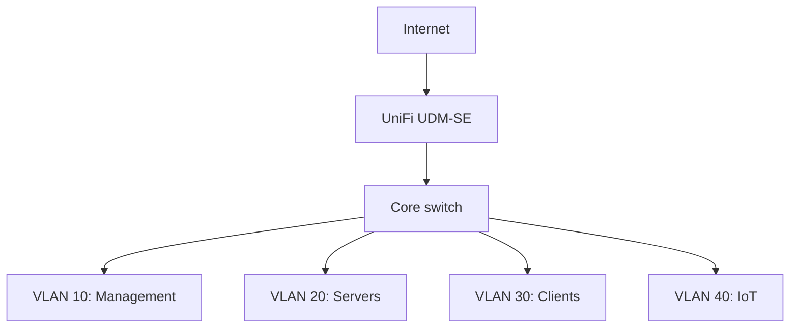

# Homelab infrastructure

A public, sanitized engineering notebook for Ayden Lotter’s segmented home network and Linux services.

[Portfolio](https://portfolio.disdata.info/) · [Linux diagnostic toolkit](https://github.com/GraniteCanyon/linux-admin-scripts) · [DisData technical subset](https://github.com/GraniteCanyon/disdata-technical)

## The problem

A home network becomes an infrastructure problem when it also runs virtual machines, storage, and public-facing services. Management access, general clients, servers, and IoT should be distinguishable, and an outage needs a repeatable investigation path—not a collection of blind restarts.

## Architecture



This is a logical overview, not a switch-port map or exported configuration. The lab includes Proxmox, Linux hosts, NAS storage, and NVIDIA DGX Spark. Device-to-VLAN assignments, IP addresses, firewall exports, and administration endpoints are intentionally omitted.

## What I built and operate

- Four VLANs on UniFi infrastructure, with DHCP, static addressing, and firewall rules.
- Linux hosts, Proxmox workloads, and NAS storage.
- Fiber links and CAT6 termination/testing.
- Private-LAN AI serving with Docker, vLLM, and OpenWebUI on DGX Spark.
- A separate public application, DisData, exposed through Cloudflare Tunnel.

These are documented on the linked portfolio. This repository makes the topology and troubleshooting method reviewable; it is not infrastructure-as-code for the complete live environment.

## Repository map

| Artifact | Purpose |
| --- | --- |
| [Logical topology](docs/topology.md) | Roles, trust boundaries, and design limitations |
| [Connectivity runbook](docs/connectivity-runbook.md) | Physical link → addressing → routing/policy → DNS → service |
| [Change and recovery checklist](docs/change-control.md) | Before/after evidence and rollback conditions |
| [Policy worksheet](examples/policy-intent.csv) | Proposed review baseline, explicitly not the deployed ACL |
| [Example inventory](examples/inventory.json) | Documentation-only fixture without live host identifiers |
| [Repository checks](tests/test_repository.py) | Inventory, VLAN, and internal-link consistency |

## How I troubleshoot it

Start with the failure’s scope: one client, one VLAN, one host, or every service? Check link and addressing before chasing application logs. Compare a local service check with a client-network check and then public access. Capture evidence before modifying a firewall or restarting a process.

The [runbook](docs/connectivity-runbook.md) records the questions, commands, and interpretation. The [DisData write-up](https://github.com/GraniteCanyon/disdata-technical) shows why a public endpoint failure does not necessarily mean the application has failed.

## What I learned

- A VLAN diagram communicates separation, but does not prove firewall enforcement. Test intended allowed and denied paths from actual source networks.
- Device-to-network placement and service dependencies are different diagrams; combining them can hide the failure boundary.
- A running process does not establish that its clients can reach it.
- Public documentation should preserve the reasoning while withholding administrative details.

These are engineering takeaways, not claims of enterprise employment, audited compliance, or measured availability.

## Validate the documentation

Python 3.11+; standard library only:

```sh
python3 -m unittest discover -s tests -v
```

The checks validate repository consistency only. They do not connect to the lab or certify its isolation. Follow the runbook to validate real connectivity with authorization.

## Scope and next steps

No credentials, live addressing, customer data, private configuration exports, school assignments, or fabricated incident results are included. The policy worksheet and sample inventory are examples, not proof of deployed controls. Next useful evidence would be sanitized allowed/denied-path test results and a restore-test record; neither is claimed here.
