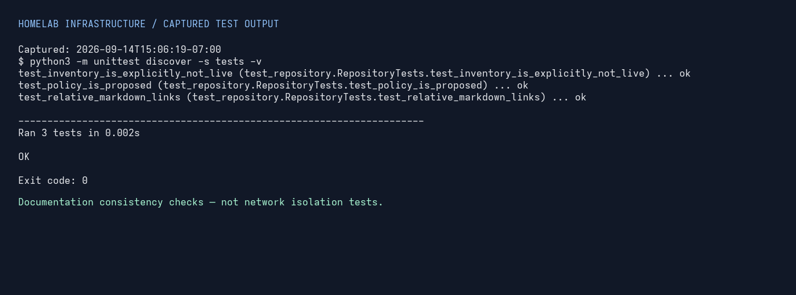

# Validation results — sanitized live session

Captured **2026-09-14 at 15:06:19 PDT (UTC−07:00)**. These are actual observations, not example outcomes. Only role labels are published; private addresses and service ports are omitted.

## Network path check

| Source VLAN | Intended destination role | Expected result | Actual result | Command/tool | Date | Pass/fail |
| --- | --- | --- | --- | --- | --- | --- |
| Unverified: no controller/switch evidence available | Private LAN inference service | TCP connection accepted | TCP connection established | Python `socket.create_connection((DESTINATION, PORT), timeout=3)` | 2026-09-14 | PASS (TCP reachability only) |

The source host has an active Ethernet link, but its IP address is not evidence of switch VLAN assignment. This result does **not** prove inter-VLAN routing, application health, authentication, or firewall isolation. No inference request was sent.

**Denied-path validation is pending**, not passed: a confirmed source VLAN, an intended denied destination/port, and the applicable policy are needed. A timeout by itself will not be labeled a proven firewall deny.

## Repository snapshot restore

A real, limited restore check was also performed on repository revision `56972cb9cedd7385722c0a45ead240b90c61d9be`:

1. Export committed files with `git archive HEAD` to a temporary archive.
2. Extract into a separate temporary directory using `tar -xf snapshot.tar -C RESTORE_DIR`.
3. Compare the restored README SHA-256 with `git show HEAD:README.md`: **match**.
4. Run `python3 -m unittest discover -s tests -v` in the restored directory: **exit 0**.

Scope: repository documentation snapshot only. This is **not** a NAS backup, VM restore, SQLite restore, or service disaster-recovery test. Temporary test files were removed after verification.

## Repository checks

The original checkout also passed all three checks with exit 0. These validate documentation consistency—not the live network.

The image is a browser-rendered capture of the actual saved command output, not a screenshot of a terminal emulator. The command output is preserved verbatim below the capture timestamp.

- [Text transcript](evidence/unittest-output.txt)
- [Sanitized machine-readable observations](evidence/validation-summary.json)

## Still needed

An allowed/denied-path test matrix from confirmed VLAN sources and a real service/data restore test. Neither is claimed by this limited session.
